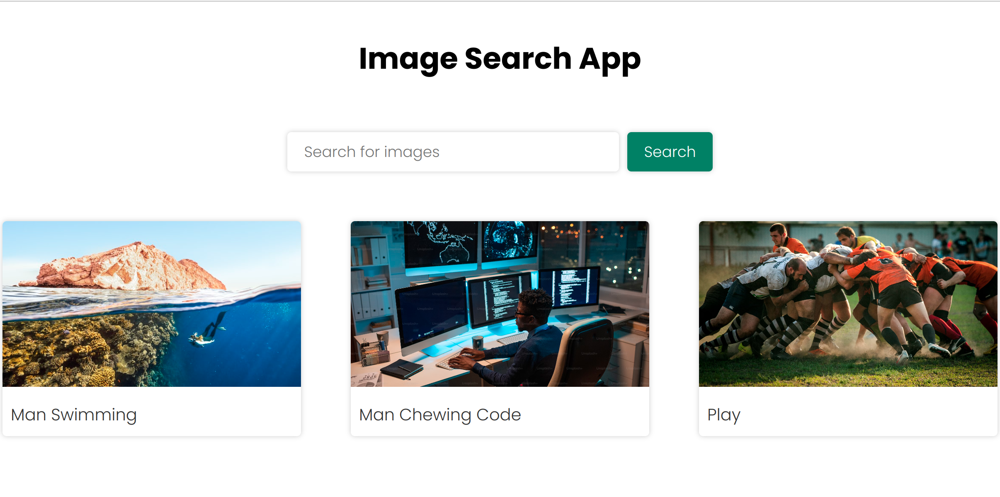

# Image Search App

An image search web application that allows users to search for images using the Unsplash API. Users can enter search queries and view image results with links to the source.




## Getting Started

Follow the instructions below to set up and run the Image Search App locally on your machine.


### Prerequisites

- Node.js: Make sure you have Node.js installed on your machine.

### Installation

1. Clone the repository to your local machine:

```bash
    git clone https://github.com/yourusername/your-repo.git
```

2. Change to the project directory:

```bash
    cd your-repo
```

3. Install project dependencies:

```bash
    npm install
```

4. Set up your Unsplash API access key:

- Get an API access key from Unsplash.
- Replace YOUR_ACCESS_KEY in script.js with your actual access key.

## Usage

1. Open index.html in your web browser.

2. Enter search queries in the input field and click the "Search" button to view image results.

3. Click on images to open them in a new tab with the source link.

4. Click the "Show more" button to load additional image results.

## Contributing
If you would like to contribute to this project, please follow these steps:

1. Fork the project and create a new branch for your feature or bug fix.

2. Make your changes and commit them with descriptive messages.

3. Push your changes to your forked repository.

4. Create a pull request to the original repository, detailing your changes.

## License

This project is licensed under the MIT License - see the LICENSE file for details.

## Acknowledgments

This project was created as a sample project for learning purposes.

The preview published page: [[https://john-thabuks.github.io/my_Image_Search_App/]]

## Author
Name: John Muthabuku

Email: thabuksjohn@gmail.com


